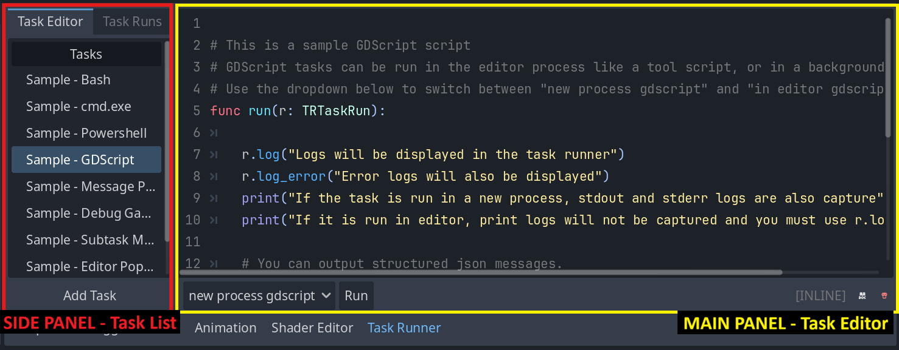
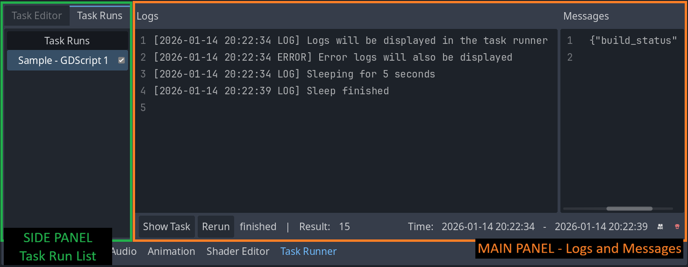
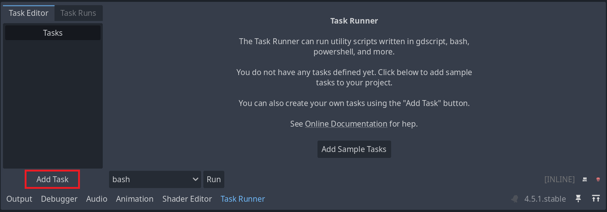
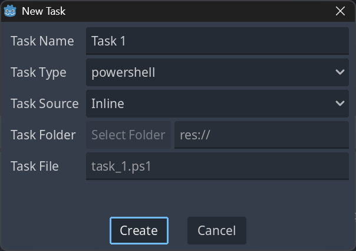
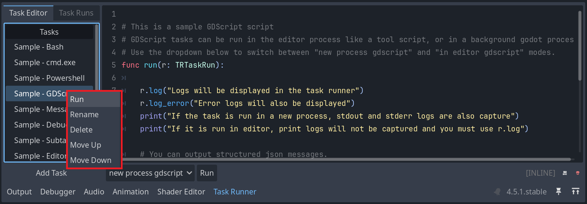
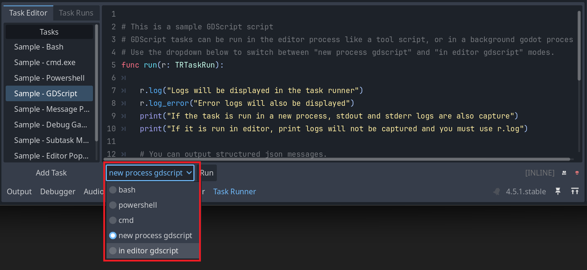
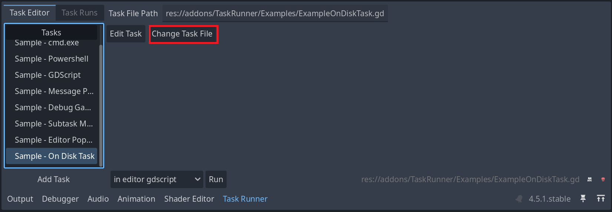
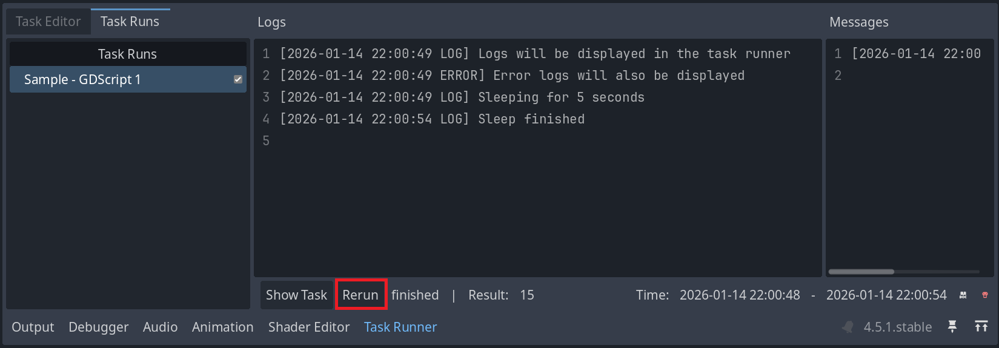
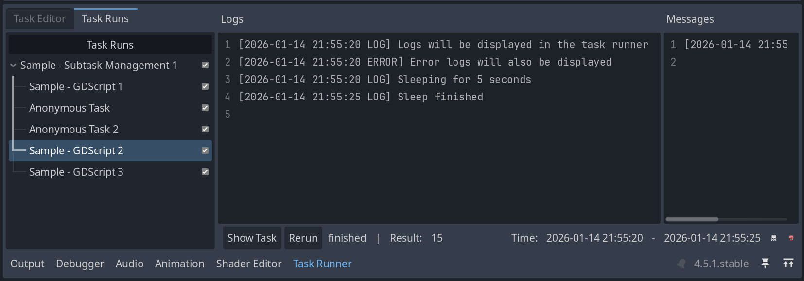

# Using Task Runner

This guide covers the fundamental operations for working with the Task Runner plugin: creating, viewing, editing, and running tasks.

## Table of Contents

- [Understanding the Interface](#understanding-the-interface)
    - [Task Editor Tab](#task-editor-tab)
    - [Task Runs Tab](#task-runs-tab)
- [Task Types and Supported Languages](#task-types-and-supported-languages)
    - [In-Editor GDScript](#in-editor-gdscript)
    - [New Process GDScript](#new-process-gdscript)
    - [Bash](#bash)
    - [PowerShell](#powershell)
    - [Batch](#batch)
- [Creating Tasks](#creating-tasks)
    - [Task Sources](#task-sources)
    - [Creating a New Task](#creating-a-new-task)
    - [Importing an Existing Task](#importing-an-existing-task)
- [Viewing Tasks](#viewing-tasks)
- [Editing Tasks](#editing-tasks)
    - [Rename Tasks](#rename-tasks)
    - [Reorder Tasks](#reorder-tasks)
    - [Delete Tasks](#delete-tasks)
    - [Change Task Type](#change-task-type)
    - [Change File (On-Disk Tasks Only)](#change-file-on-disk-tasks-only)
- [Running Tasks](#running-tasks)
    - [How to Run a Task](#how-to-run-a-task)
    - [What Happens When a Task Runs](#what-happens-when-a-task-runs)
    - [Interacting with Task Runs](#interacting-with-task-runs)
    - [Viewing Task Output](#viewing-task-output)

## Understanding the Interface

The Task Runner plugin adds a dock to the Godot Editor's bottom panel (alongside Output, Debugger, etc.) with two main tabs:

### Task Editor Tab

- **Side panel**: List of all registered tasks
- **Main panel**: Editor for the selected task's contents
  - Text editor for inline tasks (stored in `project.godot`)
  - Properties panel for on-disk tasks (external script files)

Use this tab to create, edit, and manage your tasks.

### Task Runs Tab

- **Side panel**: History of task runs for the current editor session
- **Main panel**: Logs and messages for the selected task run
  - Supports hierarchical view for tasks with subtasks

Use this tab to monitor task execution and debug issues.

## Task Types and Supported Languages

The Task Runner supports multiple scripting languages, each suited for different use cases.

For working examples of tasks in each supported language, see the [Examples](../Examples/README.md) folder in the repository.

### In-Editor GDScript

Godot's native scripting language, run from within the current editor process. This allows you to access editor state and automate editor actions in the current window, but also risks modifying your current editor and changing editor state from tasks accidentally.

In-Editor GDScript tasks also allow the creation of UI popups during task runs, which enables UI-based workflows (wizards, configuration panels, etc.).

On some operating systems, spawning background processes can be slow. In-Editor tasks can be noticeably faster.

**Platform support:** All platforms

**File extension:** `.gd`

**Example:** [gdscript_sample.gd](../Examples/SampleTasks/gdscript_sample.gd)

### New Process GDScript

Godot's native scripting language, run in a new Godot process. This isolates the task and prevents it from modifying editor state. This makes New Process GDScript tasks the generally safer option between the two GDScript execution modes.

**Platform support:** All platforms

**File extension:** `.gd`

**Example:** [gdscript_sample.gd](../Examples/SampleTasks/gdscript_sample.gd)

### Bash

Unix shell scripting.

**Platform support:** Linux, macOS

**File extension:** `.sh`

**Example:** [bash_sample.sh](../Examples/SampleTasks/bash_sample.sh)

> **Note:** Bash tasks are not supported on Windows by default.
> 
> You may change the `bash` executable to specify Git Bash or WSL by modifying the Project Settings. See the [Project Settings](02_additional-features.md#project-settings) section in the Additional Features document.
> 
> Alternatively, you may implement a new task type specifically for Git Bash or WSL. See [Extending Task Runner](03_extending-task-runner.md) for details.

### PowerShell

Windows PowerShell scripting.

**Platform support:** Windows

**File extension:** `.ps1`

**Example:** [powershell_sample.ps1](../Examples/SampleTasks/powershell_sample.ps1)

> **Note:** PowerShell Core (`pwsh`) is not supported by default.
> 
> You may implement a new task type specifically for PowerShell Core. See [Extending Task Runner](03_extending-task-runner.md) for details.

### Batch

Windows Command Prompt scripting.

**Platform support:** Windows

**File extensions:** `.bat`, `.cmd`

**Example:** [batch_sample.cmd](../Examples/SampleTasks/batch_sample.cmd)

## Creating Tasks

### Task Sources

Tasks can be stored in two ways:

**Inline Tasks** are stored in your `project.godot` file and can be edited directly in Task Runner's text editor.

**On-Disk Tasks** are stored as separate files in your project and can be edited in any text editor or Godot's script editor.

### Creating a New Task

1. Open the Task Runner dock to the **Task Editor** tab
1. Click **Add Task** at the bottom of the side panel

1. Select **New Task**

1. Configure your task:
   - **Task Name**: A descriptive name for your task
   - **Task Type**: Choose the language (GDScript, Bash, PowerShell, Batch)
   - **Task Source**: Choose Inline or On Disk
   - **Task Folder** (if On-Disk): Specify where the task file should be saved
   - **Task File** (if On-Disk): Specify the name of the script file that will be saved to disk

### Importing an Existing Task

If you already have a script file:

1. Open the Task Runner dock to the **Task Editor** tab
1. Click **Add Task** at the bottom of the side panel
1. Select **Existing Task** to open a file selection dialog
1. Navigate to your script file
1. The Task Runner will try to automatically detect the type based on file extension
1. File tasks will be automatically named. You may update the name after the task is imported.

## Viewing Tasks

To see all registered tasks:

1. Navigate to the **Task Editor** tab
1. View the task list in the left side panel
1. Click any task to view or edit its contents in the main panel

Tasks appear in the order they were created. You can reorder them using the context menu (see [Editing Tasks](#editing-tasks)).

## Editing Tasks

Right-click any task in the task list to access these operations.

### Rename Tasks

1. Right-click the task -> **Rename**
1. Enter a new name in the dialog
1. Press Enter to confirm

### Reorder Tasks

1. Right-click the task -> **Move Up** or **Move Down**
1. Tasks reorder immediately in the list

Use this to organize tasks logically (e.g., grouping build tasks together).

### Delete Tasks

1. Right-click the task -> **Delete**
1. Confirm in the dialog

**Note**: For on-disk tasks, only the task registration is removed. The script file remains in your project.

### Change Task Type

To switch a task to a different language:

1. Select the task in the task list
1. Use the dropdown menu at the bottom of the main panel
1. Choose the new task type

**Important**: Task Runner doesn't convert your code syntax automatically. Ensure your script is valid for the target language.

### Change File (On-Disk Tasks Only)

To point an on-disk task to a different file:

1. Select the on-disk task
1. Click **Select File** in the main panel
1. Choose a different script file

## Running Tasks

### How to Run a Task

**Option 1:** Right-click the task in the task list then click **Run**

**Option 2:** Select the task, then click the **Run** button in the main panel

### What Happens When a Task Runs

1. Task Runner automatically switches to the **Task Runs** tab
1. Output logs appear in real-time in the main panel
1. If the task spawns subtasks, they appear as a tree in the side panel
1. You can click any subtask to view its specific output

### Interacting with Task Runs

While viewing a task run, you have these controls:

**Rerun** - Execute the task again with the same configuration

- This clears the previous output for that task run.
- Task state is not snapshotted - if you modify a Task then rerun a Task Run, the new run will use the latest version of the Task.
- Rerunning will fail if the task has been deleted since it was last run.
- Anonymous tasks and subtasks run in separate processes handle reruns differently than regular tasks. When rerun, they will cause their parent task to be rerun instead.

**Cancel** - Stop a task that's currently running

- Canceling a parent task will also attempt to cancel any running subtasks.
- Note that for in-editor GDScript tasks, canceling may not work since the task must listen for and respond to the `cancel_requested` boolean variable while executing.
- For all other new-process tasks (New Process GDScript, Bash, PowerShell, etc.), the process is killed immediately without waiting for the process to respond.

### Viewing Task Output

The Task Runs main panel shows:

- **Standard output** from your script (either `stdout` for subprocesses, or `TRTaskRun.log` calls from GDScript Tasks)
- **Error output** from your script  (either `stderr` for subprocesses, or `TRTaskRun.log_error` calls from GDScript Tasks)
- **Messages** passed using Task Runner's message API (see [Additional Features](02_additional-features.md))

For tasks with subtasks:

- The side panel shows a hierarchical tree view
- Click any task or subtask to see its specific output
- Parent task output includes coordination logs
     - It is possible to prevent child tasks from piping their output to the parent task's logs by passing false to the `pipe_to_parent` parameter in `create_subtask` or `run_subtask`

---

**Next**: Learn about [Additional Features](02_additional-features.md) including message passing, subtasks, and anonymous tasks.
