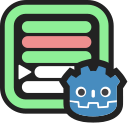
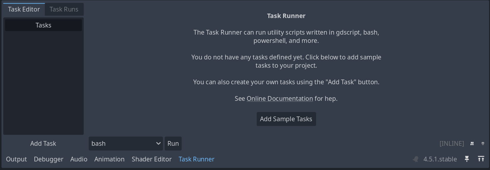

# Godot Task Runner

Godot Task Runner is an editor plugin that lets you write and execute scripts in the Godot Editor. Bash, Powershell, Batch, and GDScript scripts are supported.

## Features

- **Multi-language support**: Write tasks in GDScript, Bash, Batch, or PowerShell
- **Integrated execution**: Run tasks and view output directly in the Godot editor
- **File-based tasks**: Execute external scripts from your project
- **Task chaining**: Spawn subtasks and pass messages between tasks
- **Team-friendly**: Centralize project automation for consistent workflows

## Getting Started

### Requirements

**Godot Version:** 4.5 or later

**Optional (for language support):**
- **Bash tasks**: Unix-based OS (Linux/macOS) or WSL/Git Bash on Windows (untested)
- **PowerShell tasks**: Windows OS (PowerShell Core on Linux/macOS untested)

> **Note:** GDScript tasks work on all platforms without additional requirements.

### Installation

Follow the [official Godot plugin installation guide](https://docs.godotengine.org/en/stable/tutorials/plugins/editor/installing_plugins.html) to install from the Asset Library or install manually from GitHub. The plugin can be found in the Asset Library [on this page](https://godotengine.org/asset-library/asset/4678).

**From Asset Library**:
1. Open the AssetLib tab in Godot
1. Search for "Godot Task Runner"
1. Download and install

**Manual Installation**:
1. Clone or download this repository
1. Copy the `addons/TaskRunner` folder into your project's `addons/` directory
    - You may need to create the `addons` folder if it does not already exist
    - Note that the casing is important, it must be named `addons` (all lowercase)
1. Enable the plugin in **Project -> Project Settings -> Plugins**

Once enabled, Task Runner adds a dock to the bottom panel of the Godot editor.

### Quickstart

1. Open the **Task Editor** tab in the Task Runner dock
1. Click the **Add Sample Tasks** button to generate sample tasks
1. Select the `Sample - GDScript` task from the list
1. Click **Run** to execute the task

The Task Runner automatically switches to the **Task Runs** tab to display your output.

## Documentation

Documentation is available in `Docs/`. See [documentation](Docs/README.md) for a complete table of contents.

Topics covered include:

- Creating, editing, running, and managing tasks
- **Advanced features:** on-disk tasks, message passing, task rerun, subtask spawning, anonymous tasks
- **Extending Task Runner:** adding language support and programmatic task registration

## Examples

Explore practical examples in `Examples/`. See [examples](Examples/README.md) for details.

Examples include:
- Sample tasks demonstrating each supported language
- Demo scripts showing programmatic interaction with Task Runner

## Contributing

Contributions are welcome! Please search existing [issues](https://github.com/Rushdown-Studios/GodotTaskRunner/issues) and pull requests before submitting new ones.

See [CONTRIBUTING.md](CONTRIBUTING.md) for guidelines on submitting code, requesting features, and bug reports.

## Friendship

This project was created by [Rushdown Studios](https://www.rushdownstudio.com/) because we like nice things. If you want help creating your next Godot game, reach out! We'd love to help.

## License

This project is licensed under the MIT License. See [LICENSE.md](LICENSE.md) for details.
